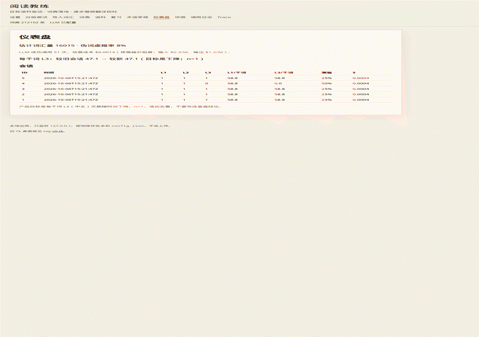

# 阅读教练 Agent（Reading Coach Agent）

面向中文 CS / AI 学习者的**目标语料驱动**阅读教练：你给它一组真正要读的英文材料，它根据你已经认识的词，标出缺口、排出阅读顺序，阅读时只给刚好够用、**有词典依据**的提示，读完再检测并写回记忆。

旧版 macOS Tk 桌面应用已归档在 [`v0-tk`](https://github.com/NafYoung/english-reading-assistant/releases/tag/v0-tk)。那个版本默认模型 `deepseek-chat` 已于 2026-07-24 下线，若要运行请把 `config.json` 里的 `model` 改成 `deepseek-flash`。

## 本地安装（macOS / Linux）

需要 Python 3.12+。推荐用 [uv](https://docs.astral.sh/uv/)：

```bash
# 安装 uv（若尚未安装）
curl -LsSf https://astral.sh/uv/install.sh | sh

git clone https://github.com/NafYoung/english-reading-assistant.git
cd english-reading-assistant
uv sync
```

第一次使用构建本地词典（下载 ECDICT 压缩包约 207MB，精简后约 36MB / 21 万条，只需一次）：

```bash
uv run era setup-dict
uv run era serve
```

浏览器打开 http://127.0.0.1:8000 。应用只监听本机。

没有 DeepSeek Key 时应用也能启动，设置页会清楚提示。想先看界面、不花 API 费用：

```bash
uv run era serve --mock
```

有 Key 时二选一：在 `/setup` 粘贴，或：

```bash
export DEEPSEEK_API_KEY=sk-...
uv run era serve
```

**不要**把 Key 写进仓库。`config.json` 和 `./data/` 已 gitignore。

## 五分钟上手

1. **设置**：打开 `/setup`，把 DeepSeek API Key 粘贴进去（欧路 Key、墨墨 Token 可选）。点「保存设置」，再点「测试连接」。成功后可在「调用日志」看到一条 `ping` 记录。
2. **分级测试**：打开「分级测试」，按是否认识作答（含伪词）。约 5 分钟，得到词汇量估计。
3. **导入已知词（可选）**：上传一个每行一个词的 TXT，或填写欧路 / 墨墨凭证。欧路生词本会标成 `learning`（查过 = 曾经不认识）。
4. **导入语料**：新建语料，粘贴一个 URL、上传 PDF 或 Markdown。看导入报告里的词次、乱码块过滤、OOV。
5. **阅读**：打开文档。默认只给预测生词加波浪线（L1）。点词只从 ECDICT / 已审核术语里选义项；没有合适义项会明确说「词典中没有符合本句的义项」，并进入术语审核队列。同一句要先看「结构」（L2）才能打开「中文」（L3）。
6. **读后**：结束阅读 → 确认没点过的预测生词 → 3 道理解题 + 语境填空。结果写进词状态和复习卡片。
7. **看变化**：`/dashboard` 里看每千词 L3（中文求助）是否下降；`/evals` 里跑 E1–E6。

## 它解决什么问题

整页翻译能让你「看懂这一篇」，但不会让你下次少靠翻译。这个应用站在**目标语料**上：先量你大概认识哪些词，再告诉你这组材料缺什么，阅读时默认只标预测生词，卡住才给句子结构，最后才给中文。释义必须来自 ECDICT 或你批准过的 AI 术语，**系统不会编造词典里没有的意思**。

## 架构（人话版）

```
浏览器（Jinja2 + htmx，无前端构建）
        │
        ▼
FastAPI（只监听 127.0.0.1）
        │
        ├── SQLite  era.db     词状态、会话、测验、LLM 日志
        ├── SQLite  ecdict_slim.db   约 21 万义项（只读，LLM 只能从这里选 ID）
        ├── 术语表 glossary_terms    你批准后才进入候选
        └── DeepSeek deepseek-flash  选义项 / 结构 / 翻译 / 出题 / 规划
            └── 规划这一步才开 thinking；失败则用规则计划兜底
```

数据在 `./data/`。密钥在本机 `config.json` 或环境变量 `DEEPSEEK_API_KEY`。

CLI：`era setup-dict` · `era serve` · `era serve --mock` · `era eval e1`（到 e6）

## 评测（E1–E6）

在 `/evals` 逐条标注，或 `uv run era eval e3`。报告写入 `evals/reports/YYYY-MM-DD-eN.md`。

下面是 **mock LLM + 仓库内可再分发短句** 在 2026-10-06 跑出的自动指标（没有真实 API Key）。填入 DeepSeek Key 并标注后请重跑。这是工程验收线，不是论文结论。n=1。

| ID | 测什么 | mock 自动结果 | 基线 |
|---|---|---|---|
| E1 | 词形还原 | B2 **5/6（83%）**；B0 小写 3/6（50%）。漏掉 `routing→route`（simplemma）。不用 ECDICT `exchange`（number→numb） | B0 / B1 |
| E2 | PDF 乱码块 | 垃圾块召回 3/3，正文误删 0/3 | 不过滤召回 0 |
| E3 | 义项选择 | top-1 **6/6**，非法输出 0/6；`transformer`/`embedding`/`orchestrator` 为 `no_fit`，没有编造 AI 释义。B0 总选 E1 只有 3/6 | B0 总选 E1 |
| E4 | 未知词预测 | 8 条合成样本上 B0 与 B2 都是 F1=1.00，样本太小、不能当结论 | B0 频次门槛 |
| E5 | 理解题 | mock 跳过「不看原文能否猜中」；有真实 Key 才跑校验 A/B | 关闭校验 |
| E6 | L2 结构 | 逐字一致 **4/4** | — |

演示（mock LLM，本地界面）：



E7（两周自用：每千词 L3 趋势）要真实阅读数据，不在安装时编造。

成本按 DeepSeek `deepseek-flash` 文档（2026-10-06）：高峰输入 $0.3/M、输出 $1.2/M。规划里一篇会话粗算约 $0.023；**以 `/debug/llm-calls` 和仪表盘为准**。

## 从 v0 Tk 到 v1 为什么转向

旧版是 macOS Tk 桌面应用，对一篇长文做分析。默认模型名已经下线；词典义项没有「只能选候选、不能编造」这条硬约束；也没有按**一组目标材料**算缺口、排顺序、读完测验再写回记忆。v1 改成本地 Web：一个人用 Python 就能维护，验收也在浏览器里完成。旧代码在 tag `v0-tk`，不在这条主线上修。

## 开发

```bash
uv sync --extra dev
uv run pytest -q
uv run ruff check src tests
```

GitHub Actions 在 push / PR 时跑同一套检查。

## 许可证

MIT。词典数据来自 [ECDICT](https://github.com/skywind3000/ECDICT)（MIT）。PDF 解析使用 pdfminer.six（MIT），不使用 AGPL 的 PyMuPDF。
